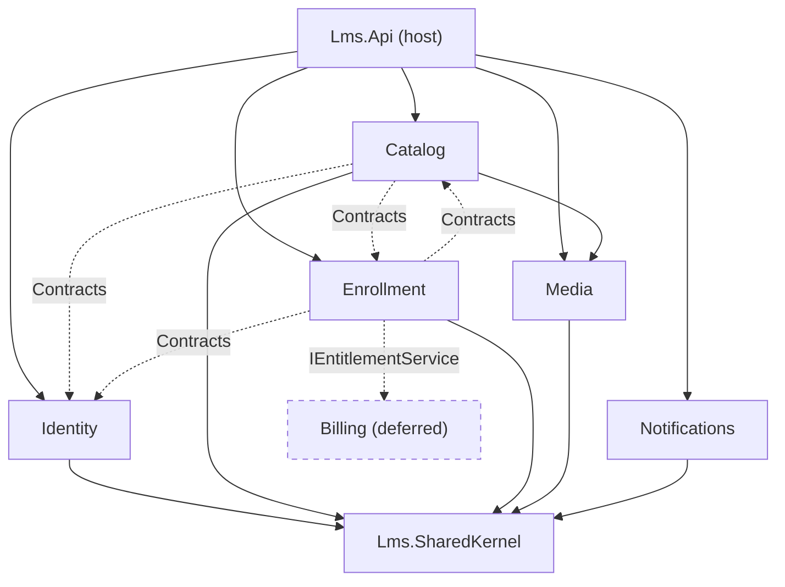
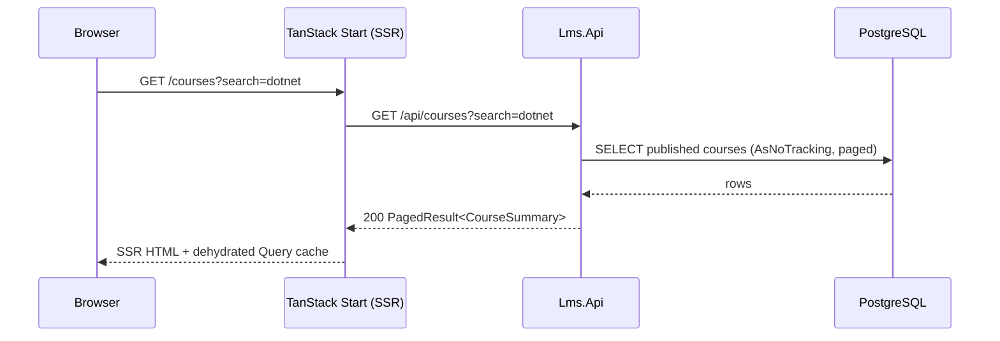
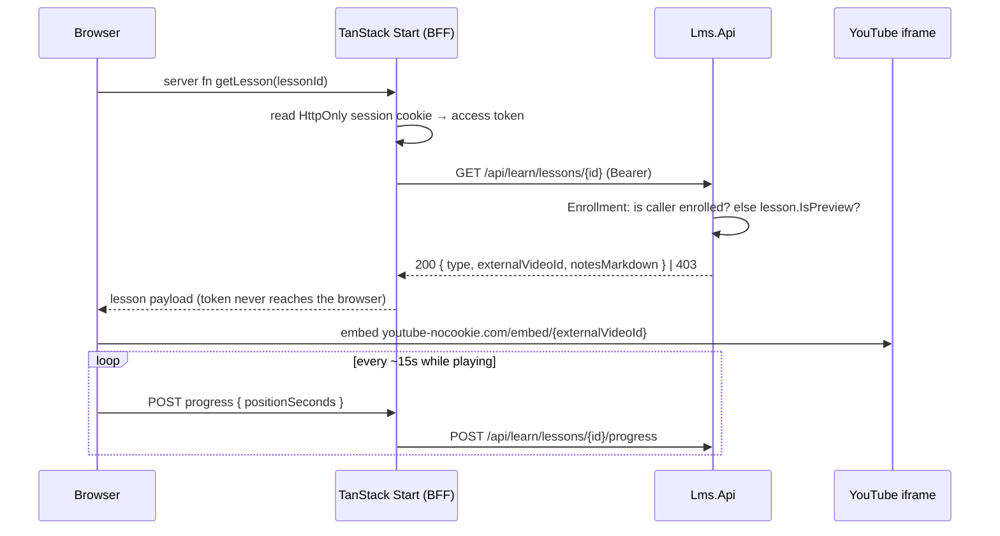
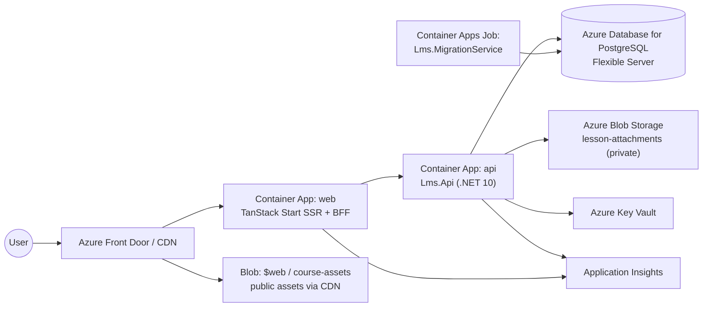

# 01 — High-Level Architecture

> Decision: **Modular monolith**, deployed as two containers (API + web) on Azure.
> Prerequisite reading: [`00-overview.md`](00-overview.md) — especially the Course/Chapter/Lesson vocabulary.

---

## 1. Decision: modular monolith, not microservices

The brief states a preference for a monolith and asks for a decision. **Agreed — modular monolith.** It is the right call here on the merits, not merely a deferral:

- **The aggregates are tightly coupled by nature.** Enrolling, tracking progress, and computing completion all read the Course curriculum. Splitting Catalog from Enrollment turns a single foreign-key join into a network call plus a cache plus a staleness policy. You would be paying distributed-systems tax to solve a problem you do not have.
- **There is no divergent scaling profile.** Catalog reads dominate, but they scale by adding output caching and read replicas — not by isolating a service.
- **Team size.** Microservices pay off when independent teams need independent deploy cadence. One team deploying one artifact does not need that, and gets a debugging story that fits in one stack trace.
- **The exit is preserved.** The Module boundaries below are exactly the seams you would cut along if a slice ever genuinely needs to leave. Enforced boundaries make that a refactor, not a rewrite.

**What we are *not* doing:** distributed transactions, a service mesh, per-service databases, an API gateway, or a message broker. One process, one database, in-process events.

---

## 2. Module composition

Six Modules. Five are built for MVP; `Billing` exists in this document as a boundary only.

| Module | Owns | May reference | Built in MVP |
|---|---|---|---|
| **Identity** | `User`, roles, `InstructorProfile`. Registration, login, token issuance, role grants. | — | Yes |
| **Catalog** | `Course`, `Chapter`, `Lesson`, `LessonAttachment`. Authoring, publishing, public browse. | `Identity.Contracts`, `Enrollment.Contracts` | Yes |
| **Enrollment** | `Enrollment`, `LessonProgress`. Enroll, progress, completion, next-course suggestions. | `Catalog.Contracts`, `Identity.Contracts` | Yes |
| **Media** | YouTube URL parsing/validation, Azure Blob SAS minting. Stateless — owns no tables. | — | Yes |
| **Notifications** | Outbound email (welcome, congratulations). Reacts to events; owns an outbox table. | — | Yes (thin) |
| **Billing** | `Plan`, `Subscription`, `Entitlement`. Real implementation of `IEntitlementService`. | `Identity.Contracts`, `Catalog.Contracts` | **No** — seam only |

### 2.1 Why these seams

The cut follows *who writes the data*, which is the only boundary that reliably holds:

- Catalog is written by instructors; Enrollment is written by students. Different actors, different lifecycles, different rates of change.
- Media is stateless because "where the bytes live" is the single most likely thing to change (see [`05`](05-adr-video-and-storage.md)). Isolating it means that change touches one project.
- Notifications is separate purely so that sending email cannot fail a business transaction. It consumes events and writes to an outbox.

### 2.2 Dependency direction



Solid = project reference. Dashed = reference to a `*.Contracts` project or an interface only.

**Catalog and Enrollment reference each other's Contracts, and that is not a cycle.** A `*.Contracts` project contains only DTOs, query interfaces, and event definitions, and **has no project references of its own** — not even to its owning Module. So `Catalog → Enrollment.Contracts` and `Enrollment → Catalog.Contracts` are two edges into two leaf nodes, and the assembly graph stays acyclic. The rule to hold: *implementation* dependencies must be acyclic; mutual *contract* dependencies are how two Modules stay decoupled while still exchanging data.

The two directions in practice:
- Enrollment → `Catalog.Contracts.ICourseCurriculumQuery` — needs the lesson list to compute completion.
- Catalog → `Enrollment.Contracts.IEnrollmentLookup` / `ICourseStatsQuery` — needs "is this viewer enrolled?" for the course-detail `viewer` block, and the counts for Studio stats.

Notifications deliberately has no inbound arrows: it subscribes to events rather than being called.

---

## 3. Project layout

```
LearningManagementSystem.sln
│
├─ src/
│  ├─ Lms.AppHost/                      Aspire orchestration. Dev-time only — see 06 §3.1.
│  │   └─ AppHost.cs                    postgres + azurite (persistent volumes), api, web, migrations
│  │
│  ├─ Lms.ServiceDefaults/              AddServiceDefaults(): OTel, health checks, resilience.
│  │                                    Referenced by Lms.Api and Lms.MigrationService.
│  │
│  ├─ Lms.Api/                          Host. Composition root only.
│  │   ├─ Program.cs                    AddXModule(...) + MapXEndpoints(...) calls
│  │   ├─ Middleware/                   exception→ProblemDetails, request logging
│  │   └─ appsettings.json
│  │
│  ├─ Lms.SharedKernel/                 Referenced by every Module. Kept small on purpose.
│  │   ├─ Result.cs, Error.cs           functional error returns
│  │   ├─ IClock.cs                     testable time
│  │   ├─ PagedResult.cs                one paging shape for the whole API
│  │   ├─ AuthPolicies.cs               policy name constants
│  │   └─ Events/IEventBus.cs           in-process publish/subscribe
│  │
│  ├─ Modules/
│  │  ├─ Lms.Modules.Identity/
│  │  ├─ Lms.Modules.Identity.Contracts/
│  │  ├─ Lms.Modules.Catalog/
│  │  ├─ Lms.Modules.Catalog.Contracts/
│  │  ├─ Lms.Modules.Enrollment/
│  │  ├─ Lms.Modules.Enrollment.Contracts/
│  │  ├─ Lms.Modules.Media/
│  │  └─ Lms.Modules.Notifications/
│  │
│  └─ Lms.MigrationService/             Applies all Module migrations. Runs as a job.
│
├─ tests/
│  ├─ Lms.ArchitectureTests/            NetArchTest — enforces §4 rules
│  ├─ Lms.UnitTests/                    domain invariants, no I/O
│  └─ Lms.IntegrationTests/             WebApplicationFactory + Testcontainers
│
└─ web/                                 TanStack Start app — see 06-tech-stack.md
```

### 3.1 Inside a Module

Every Module follows the same shape. Example, `Lms.Modules.Catalog`:

```
Lms.Modules.Catalog/
├─ CatalogModule.cs              AddCatalogModule(IServiceCollection, IConfiguration)
│                                MapCatalogEndpoints(IEndpointRouteBuilder)
├─ Domain/
│  ├─ Course.cs                  entity + invariants (Publish(), AddChapter(), ...)
│  ├─ Chapter.cs
│  ├─ Lesson.cs
│  └─ Events/CoursePublished.cs
├─ Features/                     one folder per use case — request, handler, endpoint
│  ├─ CreateCourse/
│  ├─ PublishCourse/
│  ├─ BrowseCourses/
│  └─ ReorderChapters/
├─ Infrastructure/
│  ├─ CatalogDbContext.cs
│  ├─ Configurations/            IEntityTypeConfiguration<T>
│  └─ Migrations/
└─ Endpoints/CatalogEndpoints.cs route group registration
```

`CatalogModule.cs` is the Module's only public surface to the host. `Program.cs` stays a list of registrations:

```
builder.Services
    .AddIdentityModule(config)
    .AddCatalogModule(config)
    .AddEnrollmentModule(config)
    .AddMediaModule(config)
    .AddNotificationsModule(config);
```

Adding a Module is one line in each of two places. That is the payoff.

---

## 4. Module isolation rules

These are what make it a *modular* monolith rather than a monolith with folders. Each is mechanically checkable.

1. **A Module may reference only another Module's `*.Contracts` project** — never its `Domain`, `Features`, or `Infrastructure`. Contracts hold DTOs, read-only query interfaces, and integration event definitions. Nothing else.
2. **No cross-Module foreign keys.** `Enrollment.CourseId` is a plain `Guid` with an index, not an FK to `catalog.Courses`. Referential integrity across Modules is enforced in the application (validate the Course exists and is published before enrolling), not by the database.
3. **One `DbContext` per Module**, one schema per Module (`identity`, `catalog`, `enrollment`, `notifications`). A Module's `DbContext` maps only its own tables. This is what makes rule 2 physically true rather than aspirational.
4. **Cross-Module reactions go through the event bus.** `CourseCompleted` is published by Enrollment; Notifications subscribes. `StudentEnrolled` / `StudentUnenrolled` are published by Enrollment; Catalog subscribes to maintain `Course.EnrollmentCount`. `CoursePublished` is published by Catalog; the host subscribes to evict the output cache. In every case the publisher does not know who is listening.
5. **Synchronous cross-Module reads go through a Contracts interface.** Enrollment needs the curriculum to compute completion, so `Catalog.Contracts` exposes `ICourseCurriculumQuery.GetAsync(courseId)` returning a flat DTO. Catalog implements it; Enrollment depends on the interface.

### 4.1 Enforcement

A single architecture test file (`Lms.ArchitectureTests`) using **NetArchTest**:

```
Types in Lms.Modules.Enrollment
  should not have dependency on "Lms.Modules.Catalog.Domain"
Types in Lms.Modules.*.Domain
  should not have dependency on "Microsoft.EntityFrameworkCore"
Types in Lms.Modules.*.Domain
  should not have dependency on "Microsoft.AspNetCore"
```

Cheap to write, runs in CI, and is the only thing that actually stops the boundaries eroding under deadline pressure. Skip it and in six months you have a distributed ball of mud in one process.

---

## 5. Deliberately skipped

The brief says *do not overkill*. Named here so their absence reads as a decision:

| Not using | Why |
|---|---|
| **MediatR (the library)** | Superseded — see [`09 §2`](09-code-conventions.md#2-the-mediator--ours-and-simpler-than-mediatr). We build our own: handler interfaces plus open-generic DI decorators. Same pipeline behaviours across ~44 endpoints, but compile-time checked, no reflection dispatch, no service locator, and no commercial licence. |
| **CQRS as an architecture** | Commands and queries have separate *interfaces* so the transaction decorator wraps one and not the other. That is all. No separate read store, no separate model, no eventual consistency between them. |
| **Separate read/write models** | The read shapes and write shapes are close enough. Project to DTOs in the query with `AsNoTracking()`. |
| **Event sourcing** | No audit or temporal-query requirement. |
| **Repository interfaces over `DbContext`** | `DbContext` is already a unit of work plus repository. Wrapping it adds a layer whose only test benefit is replaced by Testcontainers. |
| **Message broker (Service Bus)** | In-process events suffice while there is one process. The `IEventBus` abstraction means swapping to Service Bus later is one implementation. |
| **API gateway / BFF service** | The TanStack Start server *is* the BFF. No extra hop. |

---

## 6. Runtime request flows

### 6.1 Browsing the catalog (anonymous, R2)



No auth. Response is cacheable — apply ASP.NET Core output caching keyed on the query string, invalidated on `CoursePublished`.

### 6.2 Watching a gated lesson (R6, R8)



The gate is the 403 in the API. The UI hiding the lesson is convenience, not security.

### 6.3 Completing a course (R5)

```mermaid
sequenceDiagram
    participant A as Enrollment Module
    participant C as Catalog Module
    participant E as IEventBus
    participant N as Notifications Module

    A->>A: mark LessonProgress complete
    A->>C: ICourseCurriculumQuery.GetAsync(courseId)
    C-->>A: required lesson ids
    A->>A: all required complete? → Enrollment.Status = Completed
    A->>E: publish CourseCompleted(userId, courseId)
    E->>N: handle → write outbox row
    Note over N: background sender delivers email;<br/>failure never rolls back the completion
```

---

## 7. Deployment topology (Azure)



| Concern | Choice | Note |
|---|---|---|
| **Compute** | Azure Container Apps, two apps (`api`, `web`) | Scale-to-zero on dev/staging. Cheaper and simpler than AKS at this size. |
| **Database** | **Azure Database for PostgreSQL Flexible Server** (Burstable B-series for dev, General Purpose for prod) | Chosen over Azure SQL — see §7.2. Stop/start on non-prod. One server, one database, four schemas (`identity`, `catalog`, `enrollment`, `notifications`). |
| **Blobs** | Azure Blob Storage, two containers | See [`05`](05-adr-video-and-storage.md). |
| **Secrets** | Key Vault + managed identity | No connection strings in config. The API's managed identity is also what mints user-delegation SAS tokens. |
| **Migrations** | A Container Apps Job running `Lms.MigrationService` before the API rolls out | **Never migrate on app startup** — with more than one replica that is a race. The same project is sequenced locally by the AppHost with `WaitForCompletion`, so one migration path is exercised in both environments. |
| **Observability** | OpenTelemetry (via `Lms.ServiceDefaults`) → Application Insights | One correlated trace across web → api → postgres. Same instrumentation locally, exported to the Aspire dashboard instead. |
| **CI/CD** | GitHub Actions → build/push images → deploy revision | Migration job gates the API deploy. |

### 7.3 Aspire's role stops at the boundary

`Lms.AppHost` is **local development orchestration** ([`06 §3.1`](06-tech-stack.md#31-local-development-with-aspire)). It is not deployed, and no production behaviour depends on it. The deployed system is two containers, a managed Postgres server, and a storage account, provisioned by Bicep — exactly as it would be without Aspire.

Two rules keep that true:

1. **`Lms.Api` must run standalone.** Given connection strings from configuration, it starts with no AppHost present. That is what the deployed container does, and what integration tests do via `WebApplicationFactory`.
2. **Nothing in `src/Modules/` references Aspire.** The dependency is `Lms.AppHost → Lms.Api`, never the reverse. `Lms.ServiceDefaults` is ordinary OpenTelemetry and health-check wiring — it happens to be the shape Aspire expects, but it is plain ASP.NET Core and runs fine in Azure with no Aspire involved.

`azd` can deploy an Aspire app to Container Apps directly, and that is a legitimate option if you want to skip hand-written Bicep. It is not the recommendation here: the infrastructure is small and mostly static, and explicit Bicep keeps the deployed topology readable without inferring it from an AppHost graph. Revisit if the resource list grows.

### 7.1 Why the web app is a container, not a static site

TanStack Start acts as the BFF: it holds the HttpOnly session cookie and calls the API server-side (see [`04`](04-adr-authentication.md)). That requires a Node runtime. Static Web Apps would force the access token into browser JavaScript, which is the thing the BFF pattern exists to avoid.

### 7.2 Why PostgreSQL over Azure SQL

Both work. PostgreSQL is the better fit for *this* system, and the reasons are concrete rather than preferential:

- **Full-text search is built in.** `tsvector` + a GIN index handles catalog search natively, and the Npgsql EF Core provider supports it first-class via `HasGeneratedTsVectorColumn(...)`, which emits a `GENERATED ALWAYS AS (to_tsvector(...)) STORED` column. That **removes Azure AI Search from the roadmap entirely** ([`07`](07-roadmap.md)) — search stops being a future external dependency and becomes an index. This is the single strongest argument, because catalog search is the one query in the system with a known growth path.
- **Real array columns.** `Tags` becomes `text[]` with a GIN index and a translatable `.Contains(tag)`, instead of a delimited string with a `LIKE` ([`02 §3.5`](02-domain-model.md#35-tags-as-a-postgresql-array)). Better model, better query, no extra tables.
- **Cost.** A Burstable-tier Flexible Server is the cheapest managed relational option on Azure by a wide margin, and non-prod can be stopped outright. Verify current numbers in the Azure pricing calculator, but the ordering is stable.
- **Portability.** Nothing here is Azure-specific. The same database runs on Neon, Supabase, or a VPS. Azure SQL, in practice, does not leave Azure.
- **`jsonb`** for the outbox payload and any future semi-structured field, with indexing and querying — not just a `text` blob.

What you give up, and why it does not matter:

| Azure SQL advantage | Postgres answer |
|---|---|
| `rowversion` as a true concurrency token | `xmin` is Postgres's built-in row version. `IsRowVersion()` on a `uint` property maps to it automatically, and the provider suppresses all DDL for it since the column already exists on every table. Equivalent behaviour, zero schema cost. |
| `NEWSEQUENTIALID()` for non-fragmenting keys | Generate **UUIDv7 in application code** with `Guid.CreateVersion7()` (.NET 9+). Time-ordered, database-agnostic, and it removes a database round trip for key generation. Better than either provider's native option. |
| Familiarity for a .NET team | The Npgsql provider is mature and maintained by people on the EF Core team. LINQ, migrations, and tooling are identical. The learning curve is `psql` instead of SSMS. |
| Managed extras (auto-tuning, Query Store) | Flexible Server has Query Store, Intelligent Performance, and index tuning. Close enough at this scale to be a non-factor. |

**Decide this before the first migration, not after.** The switch is a provider package plus regenerated migrations — cheap on day one, tedious once there is production data.

---

## 8. Cross-cutting concerns

| Concern | Approach |
|---|---|
| **Errors** | Every failure returns RFC 9457 `ProblemDetails`. One exception-handling middleware in the host maps domain `Error` values to status codes. Handlers return `Result<T>`; they do not throw for expected failures. |
| **Validation** | FluentValidation validators registered per Module, run by an endpoint filter. 400 with a `errors` extension member on `ProblemDetails`. |
| **AuthZ** | Named policies in `SharedKernel.AuthPolicies`, applied at the route-group level (`.RequireAuthorization(AuthPolicies.Instructor)`). Resource ownership (`course.InstructorId == caller`) is checked inside the handler — a role check alone is not sufficient. |
| **Logging** | Serilog structured logging, enriched with `UserId`, `CourseId`, `TraceId`. No PII beyond user id in logs. |
| **Caching** | Output caching on anonymous catalog endpoints only. No distributed cache in MVP — add Redis when you can measure that you need it. |
| **Rate limiting** | Built-in `AddRateLimiter`. A fixed window on `/api/auth/*` (brute force) and on progress heartbeats (they are frequent by design). |
| **Idempotency** | `POST /api/courses/{id}/enroll` returns `200` with the existing enrollment if already enrolled, not `409`. Progress writes are last-write-wins upserts. |

---

## 9. Consequences

**Gained:** one deployable, one debugger, transactional consistency within a Module, and a clear future path to extraction.

**Accepted:** the whole app scales as a unit; a runaway query in one Module can affect another; boundary discipline depends on the architecture test staying green rather than on process isolation.

**Revisit if:** content volume makes catalog search a specialized workload (add a `tsvector` column first — that is an index, not a service split; see [`02 §7`](02-domain-model.md#7-data-volume-and-index-plan)), or independent teams start blocking each other on deploys.
