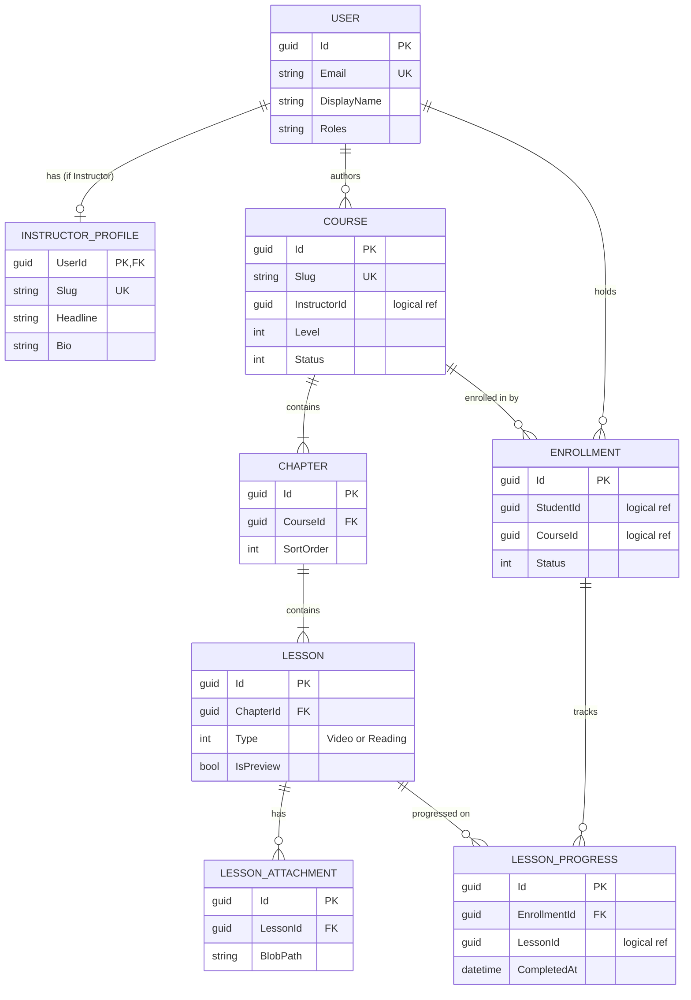
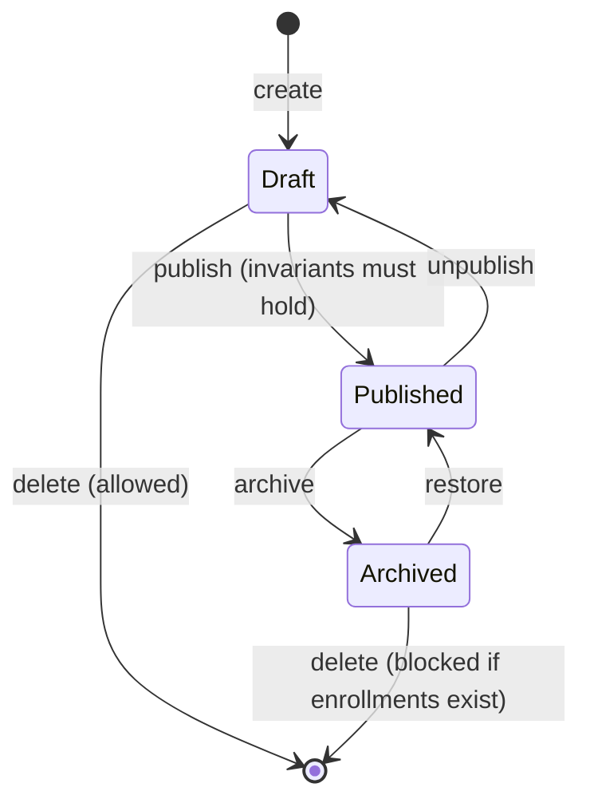
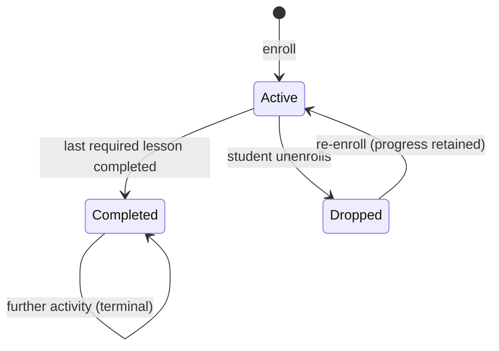

# 02 — Domain Model

> Entities, relationships, invariants, and persistence strategy.
> Vocabulary: **Course → Chapter → Lesson**. See [`00-overview.md §2`](00-overview.md#2-vocabulary-read-this-first).
> Module boundaries and the no-cross-schema-FK rule: [`01-architecture.md §4`](01-architecture.md#4-module-isolation-rules).

---

## 1. Entity-relationship overview



Relationships crossing a Module boundary (`Course→User`, `Enrollment→Course`, `LessonProgress→Lesson`) are marked *logical ref*: they are indexed `Guid` columns with **no database foreign key**. Everything inside one Module is a real FK with cascade delete.

---

## 2. Identity Module — schema `identity`

### `User`

Backed by ASP.NET Core Identity's `IdentityUser<Guid>`; the table below lists the fields this design actually uses. Framework columns (password hash, security stamp, lockout, 2FA) exist but are not part of the domain.

| Field | Type | Notes |
|---|---|---|
| `Id` | `Guid` | PK. The value that appears as the `sub` claim. Every other Module stores this. |
| `Email` | `string(256)` | Unique. Login identifier. |
| `EmailConfirmed` | `bool` | MVP: not enforced for login. See [`04 §7`](04-adr-authentication.md#7-open-items-and-hardening-backlog). |
| `DisplayName` | `string(100)` | Shown as author name and in the nav bar. |
| `CreatedAt` | `DateTimeOffset` | |

Roles use Identity's built-in role tables. Exactly three: `Student`, `Instructor`, `Admin`. Every registered user gets `Student` at registration; `Instructor` is granted by an admin ([`00 §5`](00-overview.md#5-confirmed-product-decisions)).

### `InstructorProfile`

Created when the `Instructor` role is granted. Separate from `User` because it is public-facing content, not credentials.

| Field | Type | Notes |
|---|---|---|
| `UserId` | `Guid` | PK **and** FK → `identity.Users`. One-to-one. |
| `Slug` | `string(80)` | Unique. URL segment: `/instructors/scott-allen`. |
| `Headline` | `string(160)` | e.g. "Principal engineer, distributed systems". |
| `Bio` | `string(2000)` | Markdown. |
| `AvatarBlobPath` | `string(400)?` | Path in the `course-assets` container. |
| `WebsiteUrl`, `GitHubUrl`, `LinkedInUrl` | `string(300)?` | Optional links. |

---

## 3. Catalog Module — schema `catalog`

### `Course`

The aggregate root for authoring. This is what `llm.md` calls a "module".

| Field | Type | Notes |
|---|---|---|
| `Id` | `Guid` | PK — UUIDv7, generated in application code (see §8.2). |
| `Slug` | `string(120)` | Unique. Generated from title on create, editable while `Draft`, **frozen once published** (published URLs must not break). |
| `Title` | `string(160)` | Required. |
| `Subtitle` | `string(300)?` | One-line pitch for catalog cards. |
| `Description` | `string(8000)` | Markdown. Rendered on the course page. |
| `InstructorId` | `Guid` | Logical ref → `identity.Users`. Indexed. Owner; see [`00 §6`](00-overview.md#6-actors-and-permissions). |
| `Level` | `enum` | `Beginner \| Intermediate \| Advanced`. Stored as `int`. |
| `Status` | `enum` | `Draft \| Published \| Archived`. Stored as `int`. Indexed with `PublishedAt`. |
| `ThumbnailBlobPath` | `string(400)?` | `course-assets` container. Required to publish. |
| `Tags` | `text[]` | PostgreSQL array, lowercased, max 8. GIN-indexed. See §3.5 for why this is not a join table. |
| `EstimatedMinutes` | `int` | **Derived** — sum of lesson durations. Recomputed on curriculum change. |
| `LessonCount` | `int` | **Derived** — avoids an N+1 on catalog cards. |
| `EnrollmentCount` | `int` | **Denormalized from Enrollment.** Maintained by a Catalog handler subscribing to `StudentEnrolled` / `StudentUnenrolled`. Required as a column, not a join: catalog cards display it and `?sort=popular` orders by it, and Catalog cannot query `enrollment` tables. Eventually consistent; drift is acceptable and a nightly reconcile job can true it up if it ever matters. |
| `PublishedAt` | `DateTimeOffset?` | Null while `Draft`. Catalog sorts on this. |
| `CreatedAt` / `UpdatedAt` | `DateTimeOffset` | |

### `Chapter`

| Field | Type | Notes |
|---|---|---|
| `Id` | `Guid` | PK. |
| `CourseId` | `Guid` | **FK** → `catalog.Courses`, cascade delete. |
| `Title` | `string(160)` | Required. |
| `SortOrder` | `int` | Dense, 0-based, unique per course. Rewritten wholesale on reorder (§3.4). |

No `Description` — chapters are grouping, not content. Add it only if a real need appears.

### `Lesson`

| Field | Type | Notes |
|---|---|---|
| `Id` | `Guid` | PK. |
| `ChapterId` | `Guid` | **FK** → `catalog.Chapters`, cascade delete. |
| `Title` | `string(160)` | Required. |
| `SortOrder` | `int` | Dense, 0-based, unique per chapter. |
| `Type` | `enum` | `Video \| Reading`. Stored as `int`. Determines which fields must be populated. |
| `IsPreview` | `bool` | Default `false`. When `true`, readable without enrolling. |
| `IsRequired` | `bool` | Default `true`. `false` excludes it from the completion calculation. |
| `VideoProvider` | `enum?` | `YouTube` in MVP. Null for `Reading`. The swap point — see [`05`](05-adr-video-and-storage.md). |
| `ExternalVideoId` | `string(64)?` | e.g. `dQw4w9WgXcQ`. **Not** a full URL — the URL is rebuilt from provider + id. |
| `DurationSeconds` | `int` | Video runtime, or estimated reading time for `Reading`. Feeds `Course.EstimatedMinutes`. |
| `ContentMarkdown` | `string(max)?` | The body of a `Reading` lesson. |
| `NotesMarkdown` | `string(max)?` | Accompanying notes shown beneath a `Video` lesson. |
| `CreatedAt` / `UpdatedAt` | `DateTimeOffset` | |

Both content fields are nullable at the column level; the *combination* is constrained by the invariant in §3.3 rather than by the schema. Two nullable columns beat two subtype tables for a two-case discriminator.

### `LessonAttachment`

Downloadable extras — slides, source zip, cheat sheet.

| Field | Type | Notes |
|---|---|---|
| `Id` | `Guid` | PK. |
| `LessonId` | `Guid` | **FK** → `catalog.Lessons`, cascade delete. |
| `FileName` | `string(255)` | Original name, shown to the student. |
| `BlobPath` | `string(400)` | Path in the private `lesson-attachments` container. |
| `ContentType` | `string(100)` | |
| `SizeBytes` | `long` | |
| `UploadedAt` | `DateTimeOffset` | |

Rows are written **after** the browser confirms a successful direct-to-blob upload ([`05 §5`](05-adr-video-and-storage.md#5-direct-to-blob-upload-flow)).

### 3.1 Course status lifecycle



| Status | Visible in catalog | Editable | Enrollable |
|---|---|---|---|
| `Draft` | No | Yes | No |
| `Published` | Yes | Yes (edits go live immediately — no draft/live fork in MVP) | Yes |
| `Archived` | No | No | No — but existing enrollments keep full access |

Two rules worth stating plainly: editing a published course is immediately live (versioning is out of scope), and archiving never revokes access from students who already enrolled.

### 3.2 Publish invariants

`Course.Publish()` fails unless **all** hold:

1. `Title` and `Description` are non-empty.
2. `ThumbnailBlobPath` is set.
3. At least one Chapter exists.
4. Every Chapter has at least one Lesson.
5. Every Lesson satisfies the content invariant (§3.3).
6. At least one Lesson has `IsRequired = true` — otherwise completion is vacuous.

Violations return a 422 with the specific list. Do not partially publish.

### 3.3 Lesson content invariant

| `Type` | Must have | Must be null | Also |
|---|---|---|---|
| `Video` | `VideoProvider`, `ExternalVideoId`, `DurationSeconds > 0` | `ContentMarkdown` | `NotesMarkdown` optional |
| `Reading` | `ContentMarkdown` non-empty | `VideoProvider`, `ExternalVideoId` | `DurationSeconds` = estimated read time |

Enforced in `Lesson.SetVideoContent(...)` / `Lesson.SetReadingContent(...)`. There is no public setter that can leave the entity in an invalid state, and switching type clears the other type's fields.

### 3.4 Ordering

`SortOrder` is dense and 0-based within its parent. Reordering sends the **complete ordered list of ids** (`POST .../reorder`) and the handler rewrites every row in one transaction. Do not send per-item index deltas — concurrent edits produce duplicate or gapped orders, and the debugging is miserable relative to the cost of rewriting a handful of integers.

### 3.5 `Tags` as a PostgreSQL array

`Tags` is a `text[]` column mapped straight to `string[]` on the entity — no `Tag` table, no join table.

A tag entity plus a join table is the textbook answer and the wrong trade here: tags are instructor-typed free text, capped at 8, and only ever read as a whole or filtered by exact match. On PostgreSQL the array is not a compromise — with a GIN index, `courses.Where(c => c.Tags.Contains(tag))` translates to `"Tags" @> ARRAY['dotnet']` and uses the index. That is a genuine indexed lookup, not the `LIKE '%dotnet%'` scan a delimited string would force.

**Promote to real tables** when you want tag pages, tag counts ranked by popularity, or an autocomplete backed by usage frequency. That is a migration, not a redesign.

---

## 4. Enrollment Module — schema `enrollment`

### `Enrollment`

Aggregate root for a student's relationship with one course.

| Field | Type | Notes |
|---|---|---|
| `Id` | `Guid` | PK. |
| `StudentId` | `Guid` | Logical ref → `identity.Users`. |
| `CourseId` | `Guid` | Logical ref → `catalog.Courses`. |
| `Status` | `enum` | `Active \| Completed \| Dropped`. |
| `EnrolledAt` | `DateTimeOffset` | |
| `CompletedAt` | `DateTimeOffset?` | Set when `Status → Completed`. Never cleared. |
| `LastAccessedAt` | `DateTimeOffset?` | Powers "Continue learning". |
| `LastLessonId` | `Guid?` | Resume point (R6). |
| `ProgressPercent` | `int` | **Derived, denormalized** 0–100. See §4.3. |
| `CompletedLessonCount` | `int` | **Derived, denormalized.** |

**Unique index on `(StudentId, CourseId)`** — this is what makes enroll idempotent, at the database level rather than by hoping the read-then-write does not race.

### `LessonProgress`

| Field | Type | Notes |
|---|---|---|
| `Id` | `Guid` | PK. |
| `EnrollmentId` | `Guid` | **FK** → `enrollment.Enrollments`, cascade delete. |
| `LessonId` | `Guid` | Logical ref → `catalog.Lessons`. |
| `LastPositionSeconds` | `int` | Video resume point. |
| `WatchedSeconds` | `int` | Furthest point reached, monotonic — never decreases on rewind. Basis of the ≥90% rule. |
| `CompletedAt` | `DateTimeOffset?` | Null = incomplete. Presence, not a bool, so you keep the timestamp. |
| `FirstViewedAt` / `UpdatedAt` | `DateTimeOffset` | |

**Unique index on `(EnrollmentId, LessonId)`.** Progress writes are upserts against it.

### 4.1 Enrollment status lifecycle



`Completed` is terminal. If an instructor later adds a lesson to a completed course, the existing completion stands — retroactively un-completing students would be hostile. New enrollments get the fuller curriculum.

### 4.2 Lesson completion rules

| Lesson type | Completes when |
|---|---|
| `Video` | `WatchedSeconds >= 0.9 × DurationSeconds`, **or** the student clicks "Mark complete". |
| `Reading` | The student clicks "Mark complete". Scroll depth is not a reliable proxy and is not used. |

Completion is idempotent and one-way: once `CompletedAt` is set, later progress heartbeats update position but never clear it.

### 4.3 Course completion and progress

```
requiredLessonIds = curriculum lessons where IsRequired = true
completed         = LessonProgress rows with CompletedAt != null AND LessonId ∈ requiredLessonIds
ProgressPercent   = round(100 × completed.Count / requiredLessonIds.Count)
Status → Completed when completed.Count == requiredLessonIds.Count
```

The curriculum comes from `Catalog.Contracts.ICourseCurriculumQuery` — Enrollment never joins to `catalog.Lessons` ([`01 §4`](01-architecture.md#4-module-isolation-rules)).

`ProgressPercent` and `CompletedLessonCount` on `Enrollment` are a **read optimization with exactly one writer** (the progress handler, in the same transaction as the `LessonProgress` write). `LessonProgress` rows remain the source of truth; the denormalized values exist so "My Learning" renders N courses without N curriculum lookups. If they ever disagree, recompute from `LessonProgress`.

On transition to `Completed`, publish `CourseCompleted(StudentId, CourseId, CompletedAt)`.

### 4.4 Suggestions after completion (R5)

Deterministic query, no ML, no recommender service:

1. Published courses sharing ≥1 tag with the completed course, ranked by shared-tag count.
2. Then other published courses by the same instructor.
3. Then published courses at the next level up (`Beginner → Intermediate → Advanced`).

Exclude anything the student is already enrolled in. Take 3. If fewer than 3, pad with the most recently published courses. Good enough at this catalog size; revisit when there is behavioural data worth mining.

---

## 5. Media & Notifications Modules

**Media** owns no tables. It parses and validates YouTube URLs into an `ExternalVideoId`, and mints Azure Blob SAS tokens. Stateless by design so that replacing the video provider touches one project.

**Notifications** — schema `notifications`, one table:

### `OutboxMessage`

| Field | Type | Notes |
|---|---|---|
| `Id` | `Guid` | PK. |
| `Type` | `string(100)` | e.g. `CourseCompletedEmail`. |
| `Payload` | `string(max)` | JSON. |
| `RecipientEmail` | `string(256)` | |
| `CreatedAt` | `DateTimeOffset` | |
| `SentAt` | `DateTimeOffset?` | Null = pending. Filtered index on `SentAt IS NULL`. |
| `AttemptCount` | `int` | |
| `LastError` | `string(2000)?` | |

The point of the outbox: writing the row is part of the completion transaction, so an email provider outage can never roll back a student's course completion. A hosted background service drains it with retry.

> **Built early.** This table shipped in `F-4` rather than `P-7`, because a migration pipeline you cannot verify is not worth much and an empty initial migration proves nothing. It is dependency-free infrastructure, so it fits a foundation card. `P-7` now needs only the sender and the event handler. Identifiers are snake_case (`notifications.outbox_messages`), and `Payload` is `jsonb`.

---

## 6. Billing — modeled, not built

Documented so the seam is real. **No tables are created in MVP.**

| Entity | Fields (sketch) |
|---|---|
| `Plan` | `Id`, `Code`, `Name`, `PriceMonthly`, `PriceYearly`, `IsActive` |
| `Subscription` | `Id`, `UserId`, `PlanId`, `Status`, `CurrentPeriodEnd`, `ProviderSubscriptionId` |
| `Entitlement` | `Id`, `UserId`, `CourseId?`, `Source (Subscription \| Purchase \| Grant)`, `ExpiresAt?` |

The entire coupling to the rest of the system is one interface in `SharedKernel`:

```
IEntitlementService
    Task<bool> CanEnrollAsync(Guid userId, Guid courseId, CancellationToken ct)
```

MVP registers `AlwaysAllowEntitlementService`. Enrollment's enroll handler calls it before creating the row. **That call site is the only place in Catalog or Enrollment that Billing will ever touch** — adding real billing means a new Module, a new implementation registration, and `Course.PriceTier`. Nothing about the curriculum or progress model changes.

---

## 7. Data volume and index plan

Realistic MVP scale: tens of courses, hundreds of lessons, thousands of users, and `LessonProgress` as the only table that grows meaningfully (users × lessons touched).

| Table | Index | Serves |
|---|---|---|
| `catalog.Courses` | `UX (Slug)` | Course page lookup |
| `catalog.Courses` | `IX (Status, PublishedAt DESC)` | Catalog listing |
| `catalog.Courses` | `IX (InstructorId, Status)` | Studio "my courses" |
| `catalog.Chapters` | `IX (CourseId, SortOrder)` | Curriculum load |
| `catalog.Lessons` | `IX (ChapterId, SortOrder)` | Curriculum load |
| `enrollment.Enrollments` | `UX (StudentId, CourseId)` | Idempotent enroll; enrollment check on every gated read |
| `enrollment.Enrollments` | `IX (StudentId, Status, LastAccessedAt DESC)` | My Learning |
| `enrollment.Enrollments` | `IX (CourseId)` | Studio stats |
| `enrollment.LessonProgress` | `UX (EnrollmentId, LessonId)` | Upsert target |
| `notifications.OutboxMessages` | `IX (SentAt) WHERE SentAt IS NULL` | Outbox drain |

Two additional PostgreSQL-specific indexes:

| Table | Index | Serves |
|---|---|---|
| `catalog.Courses` | `GIN (Tags)` | `Tags.Contains(tag)` → `"Tags" @> ARRAY[…]` (§3.5) |
| `catalog.Courses` | `GIN (SearchVector)` | Full-text catalog search (below) |

**Catalog search.** MVP can start with `WHERE Title ILIKE @q` over a small published set and that is honest at this size. But because the database is PostgreSQL, the upgrade is already in reach and costs one column rather than a new service: add a generated `tsvector` column over title, subtitle, and tags, and GIN-index it.

```
modelBuilder.Entity<Course>()
    .HasGeneratedTsVectorColumn(c => c.SearchVector, "english", c => new { c.Title, c.Subtitle })
    .HasIndex(c => c.SearchVector)
    .HasMethod("GIN");
```

The provider emits `GENERATED ALWAYS AS (to_tsvector('english', …)) STORED`, so the column maintains itself — no triggers, no application code, no sync job. Ranked results come from `EF.Functions.ToTsQuery` with `.Rank(...)`.

This is the concrete reason PostgreSQL was chosen ([`01 §7.2`](01-architecture.md#72-why-postgresql-over-azure-sql)): **Azure AI Search never enters the architecture.** Search stays inside the database that already holds the data.

---

## 8. Persistence strategy

Aligned with the project's EF Core conventions.

### 8.1 Context and migrations

- **One `DbContext` per Module**, each pinned to its own schema via `modelBuilder.HasDefaultSchema("catalog")`.
- Migrations live inside the owning Module. Each context has its own migrations history table (`__EFMigrationsHistory_Catalog`) so Modules version independently.
- `Lms.MigrationService` applies all of them as a **pre-deploy job**, never at app startup ([`01 §7`](01-architecture.md#7-deployment-topology-azure)) — startup migration races across replicas.
- Configuration lives in `IEntityTypeConfiguration<T>` classes, not in `OnModelCreating` overloads. No data annotations on domain entities; the domain stays persistence-ignorant.

### 8.2 Query conventions

- **`AsNoTracking()` on every read path.** Catalog browse, course detail, and curriculum loads never need change tracking. Set `QueryTrackingBehavior.NoTrackingWithIdentityResolution` as the context default and opt *in* to tracking for command handlers.
- **`AsSplitQuery()` for `Course → Chapters → Lessons`.** A single query across two collection levels produces a cartesian explosion; with ~10 chapters × ~8 lessons the duplicated course/chapter columns dominate the payload.
- **Project to DTOs in the query.** `Select(c => new CourseSummaryDto { ... })` — never materialize entities for a list view. Catalog cards need 7 columns out of ~15.
- **UUIDv7 primary keys generated in application code** via `Guid.CreateVersion7()` (.NET 9+), mapped to Postgres `uuid`. Time-ordered, so index locality is good; generated client-side, so there is no database round trip to obtain a key and entities are fully valid before `SaveChangesAsync`. Do not use `gen_random_uuid()` as a column default — v4 UUIDs are random and fragment the index.
- **Owned types / complex types** for value objects rather than separate tables.
- **`ExecuteUpdateAsync` for set-based writes** — the reorder rewrite and the outbox `SentAt` stamp. Do not load rows to change one column.
- **Optimistic concurrency** via PostgreSQL's `xmin` system column on `Course` and `Lesson`. Declare a `uint` property and call `IsRowVersion()`; the Npgsql provider maps it to `xmin` by convention and suppresses all DDL for it, since every Postgres table already has the column. Two studio tabs editing the same course surface a `409` rather than silently last-write-winning. **Costs nothing in schema** — no extra column, no trigger.
- **`jsonb`, not `text`, for the outbox payload.** Same storage cost, but queryable and indexable if you ever need to inspect the backlog.

### 8.3 Deletion

| Entity | Behaviour |
|---|---|
| `Course` (Draft) | Hard delete, cascading to chapters, lessons, attachments. Blob cleanup queued. |
| `Course` (Published/Archived with enrollments) | **Blocked.** Archive instead — students who enrolled keep access. |
| `Chapter` / `Lesson` | Hard delete, cascade. Orphaned `LessonProgress` rows are tolerated and skipped by the completion calculation, since it iterates the *current* curriculum. |
| `User` | Soft delete (anonymize email, set `IsDeleted`). Enrollment history is retained for instructor stats. |

Cross-Module cascades do not exist — there are no FKs to cascade along. Deleting a course does not delete enrollment rows; the completion calculation and My Learning filter to courses that still exist. This is the cost of Module isolation, and it is cheaper than the coupling it avoids.
