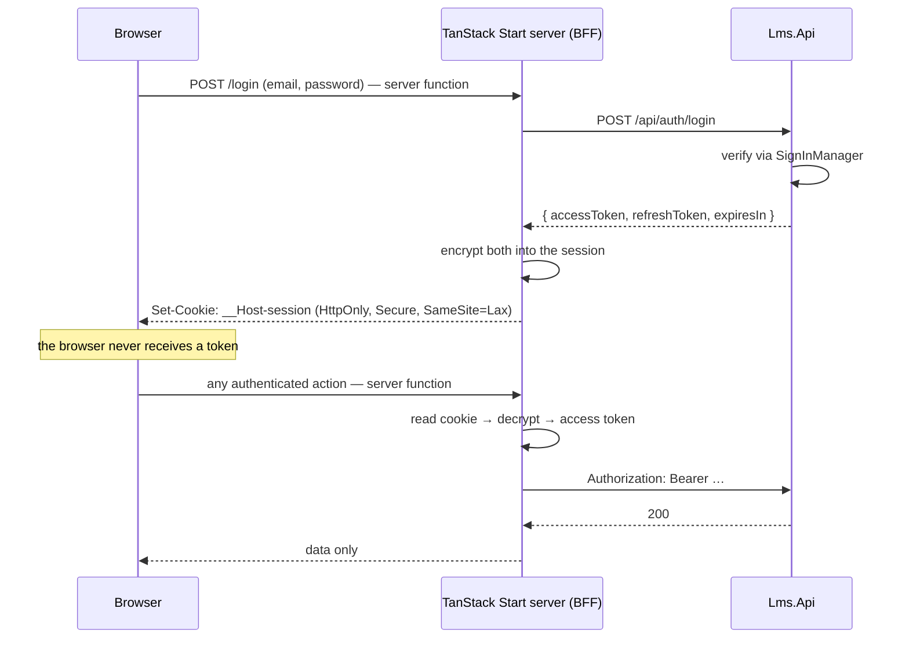

# 04 — ADR: Authentication & Authorization

> **Status:** Accepted · **Date:** 2026-08-08
> **Question asked in the brief:** *"give an idea about the authentication whether to use an Identity Provider such as Keycloak or Duende."*
> **Decision:** Neither, for now. **ASP.NET Core Identity behind a TanStack Start BFF**, with a deliberate, low-cost path to OpenIddict or Duende if and when real OIDC is needed.

---

## 1. Context

What the system actually has to authenticate, today:

- **One frontend** — the TanStack Start web app.
- **One API** — `Lms.Api`.
- **Three flat roles** — `Student`, `Instructor`, `Admin`.
- **One identity source** — email + password. Instructors are provisioned by an admin, not federated from anywhere ([`00 §5`](00-overview.md#5-confirmed-product-decisions)).
- **No B2B tenants, no SSO requirement, no third-party clients, no social login in MVP.**

That list is the whole basis of the decision. An identity provider exists to solve *federation across multiple clients and identity sources*. This system has one of each.

---

## 2. Options considered

### Option A — Keycloak

Self-hosted OSS identity provider. Full OIDC/OAuth2/SAML, admin console, user federation, social login out of the box.

| | |
|---|---|
| **For** | Free and genuinely feature-complete. Mature. No licence conversation ever. Admin UI you do not have to build. |
| **Against** | A **JVM service you now operate**: another container, another database, upgrades, realm export/import, theme customization in FreeMarker if you want branded login pages. For a .NET team it is a permanently foreign piece of infrastructure. Local development gets a docker-compose dependency and a slower inner loop. |
| **Verdict** | Real cost, no MVP benefit. Choose it when you must self-host federation and are comfortable operating a JVM service. |

### Option B — Duende IdentityServer

The .NET-native OIDC provider, and the successor to IdentityServer4.

| | |
|---|---|
| **For** | C#, in-process, EF Core stores, excellent docs, first-class BFF library. If you need OIDC in .NET, this is the reference answer. |
| **Against** | **Commercial licence.** Free only for companies under the revenue threshold and for non-production use; a paid licence otherwise. More importantly: it is a *protocol* server. You would be implementing authorization-code + PKCE flows, discovery documents, and token endpoints to serve exactly one first-party client that could simply be told the answer. |
| **Verdict** | The right upgrade path, the wrong starting point. |

### Option C — ASP.NET Core Identity + BFF ✅ **chosen**

Users, password hashing, lockout, token issuance in the monolith. The web tier holds the session; the browser holds nothing.

| | |
|---|---|
| **For** | Zero extra infrastructure and zero licence. `MapIdentityApi<TUser>` ships register/login/refresh/2FA/password-reset endpoints in-box. Users are rows in your own database, so `InstructorProfile` is a plain one-to-one and role grants are one call. Local dev is `dotnet run`. |
| **Against** | Not an OIDC provider — no third party can federate against it. Social login means adding external auth handlers yourself. You own the login UI (which you wanted anyway, for branding). |
| **Verdict** | Matches the actual requirement exactly. |

### Option D — Managed (Entra External ID, Auth0, Clerk)

| | |
|---|---|
| **For** | Someone else runs it. Social login and MFA are configuration. |
| **Against** | Per-MAU pricing that bites precisely when the product succeeds. User records live outside your database, so every instructor profile join becomes a remote id lookup and a sync problem. Vendor lock-in on the single most load-bearing table you have. |
| **Verdict** | Reasonable if you want to spend money to skip auth work. Not needed for a straightforward email/password product. |

---

## 3. Decision

**ASP.NET Core Identity for identity and tokens, consumed through a Backend-for-Frontend implemented in the TanStack Start server.**



Three properties make this the right shape:

1. **No token in browser-reachable storage.** Not `localStorage`, not a readable cookie, not a JS variable. XSS on the frontend cannot exfiltrate a bearer token, because there is not one to steal. This is the single largest security win available to a SPA, and it costs nothing here because the Start server already exists for SSR.
2. **The API stays a pure resource server.** `AddAuthentication().AddJwtBearer(...)` and nothing else. It has no notion of cookies, sessions, or login pages. If a mobile client appears later, it talks to the same API the same way.
3. **The BFF is not a new component.** TanStack Start's server runtime is already deployed for SSR; server functions and the cookie helpers in `@tanstack/react-start/server` are exactly the primitives this needs.

### 3.1 Implementation notes

**API side**
- `AddIdentityCore<AppUser>()` with `Guid` keys and role support, EF stores on the `identity` schema.
- Bearer tokens: `MapIdentityApi` covers register/login/refresh. Wrap it in the `/api/auth` shapes from [`03 §3`](03-api-design.md#3-authentication--apiauth) rather than exposing the default routes directly — you want control over the response shape and the error semantics (see the enumeration note below).
- Access token ~1 hour; refresh token ~14 days, **rotated on every use**, prior token revoked.
- Password policy: minimum 10 characters, no composition rules. Length beats character-class theatre. Lockout after 5 failures in 5 minutes.
- Claims on the access token: `sub` (user id), `email`, `name`, `role` (repeated). Nothing else — no profile data that can go stale inside a token's lifetime.

**Web side**
- Session cookie: `__Host-session`, `HttpOnly; Secure; SameSite=Lax; Path=/`. The `__Host-` prefix is not cosmetic — it forbids a `Domain` attribute, which prevents a compromised subdomain from setting a session cookie for the apex.
- Contents encrypted (AEAD) with a server-only key from Key Vault.
- Refresh happens **server-side**, transparently: if the access token is within 5 minutes of expiry, the server function refreshes before forwarding and rewrites the cookie.
- `SameSite=Lax` plus a same-origin-only server function surface makes the CSRF exposure small; still, treat any state-changing server function as requiring a POST, never a GET.

**Route guards** (the pattern confirmed against current TanStack Start docs):

```
routes/
  _authed.tsx        beforeLoad → getCurrentUser(); no user → redirect('/login?redirect=…')
  _authed/
    my-learning.tsx
    learn.$slug.$lessonId.tsx
  _instructor.tsx    beforeLoad → user must include role 'Instructor'; else 403 page
  _instructor/
    studio.*.tsx
```

`beforeLoad` on a layout route returns the user into route context, so children get it typed and without a second fetch. **These guards are UX, not security** — every one of them is backed by the corresponding `.RequireAuthorization(...)` on the API ([`03 §7`](03-api-design.md#7-authorization-matrix)).

---

## 4. Authorization model

Three named policies in `Lms.SharedKernel/AuthPolicies.cs`, applied at the route-group level:

| Policy | Requirement |
|---|---|
| `AuthPolicies.Student` | Authenticated. (Every registered user holds `Student`.) |
| `AuthPolicies.Instructor` | Role `Instructor`. |
| `AuthPolicies.Admin` | Role `Admin`. |

**Role checks are necessary but never sufficient.** Two resource-level checks live inside handlers, and they are where the real access control happens:

1. **Course ownership** — every `/api/studio/*` write asserts `course.InstructorId == caller.Id`, else `403`. Without this, any instructor can edit any instructor's courses.
2. **Enrollment gate** — every `/api/learn/*` read asserts an active or completed enrollment, unless `lesson.IsPreview`. This is R8, and it is the only thing standing between paid-tier content and the open internet.

Both are plain guard clauses in the handler, not policy handlers. A `IAuthorizationRequirement` would need to load the course to evaluate, which the handler is loading anyway — the abstraction would buy indirection and a duplicate query.

---

## 5. Making the future swap cheap

The decision above is only defensible if reversing it is not expensive. Four rules keep it that way; all four cost nothing today.

1. **`sub` is the user id, everywhere.** Catalog and Enrollment store the `Guid` from the `sub` claim. They never join to `identity.Users` ([`01 §4`](01-architecture.md#4-module-isolation-rules)). An external IdP that issues a different `sub` needs one mapping column in Identity — nothing else in the system notices.
2. **`IdentityUser` never leaves the Identity Module.** Other Modules see `Identity.Contracts.UserSummary`. The domain has no idea ASP.NET Core Identity exists.
3. **Authorization is by named policy, never by inline string comparison.** Search for `"Instructor"` in the codebase and you should find one file. If claim shapes change, one file changes.
4. **The API only ever validates a bearer token.** It does not issue one, does not read cookies, does not know how the caller authenticated. Point `JwtBearerOptions.Authority` at a new issuer and the resource server is done.

### 5.1 Migration triggers, and what to do

| Trigger | Move to | Effort |
|---|---|---|
| Social login (GitHub/Google) — likely first, for an engineering audience | Stay on Identity; add external auth handlers | Small — a few days |
| A second first-party client (mobile, CLI) | **OpenIddict** in-process: real OIDC, free, OSS, .NET-native, uses the Identity users you already have | Medium — the users do not move |
| Enterprise/B2B SSO, SAML, per-tenant IdPs | **Duende IdentityServer** (supported, licensed) or a managed provider | Large — but bounded by the four rules above |
| A mandate to self-host federation with no licence cost | **Keycloak** | Large, plus permanent JVM operations |

**OpenIddict is the answer the brief's question is really reaching for.** It is the free, OSS, .NET-native OIDC server that sits between "hand-rolled Identity" and "licensed Duende" — same protocol coverage as Duende for standard flows, no licence, and it embeds directly in this monolith rather than becoming a separate service. If you were to add a real OIDC provider on day one against my recommendation, choose OpenIddict over both Keycloak and Duende.

---

## 6. Consequences

**Accepted:**
- No standards-based federation until a later migration. Fine — nothing needs it.
- We own the login, registration, and password-reset UI. Wanted anyway, for branding.
- Password reset requires working transactional email (the Notifications Module) before any real user exists.
- The Start server is now security-relevant: its session encryption key is a production secret, and it must be in Key Vault, rotated, and never in source control.

**Gained:**
- Zero additional infrastructure, zero licence cost, and a `dotnet run` + `npm run dev` local loop with no auth container.
- Tokens are unreachable from browser JavaScript.
- Instructor onboarding is a role grant on a row you own — one endpoint, no IdP round trip, no user-sync job.

---

## 7. Open items and hardening backlog

Not MVP blockers, but do not let them slip silently:

| Item | Note |
|---|---|
| **Email confirmation** | MVP allows login before confirming. Turn on enforcement before opening public registration, or you will be hosting other people's spam. |
| **Password reset** | `MapIdentityApi` provides the endpoints; they need the Notifications Module wired to a real email provider to function. |
| **Refresh-token revocation on logout** | Must actually invalidate server-side, not just clear the cookie. |
| **2FA** | Available in Identity, off in MVP. Enable for `Admin` accounts first — that role can mint instructors. |
| **Admin bootstrap** | The first `Admin` is seeded from configuration at deploy. Never a self-service path, never a default password. |
| **Audit log** | Role grants and revocations should be recorded. Small table, worth adding before the first external instructor. |
| **User enumeration** | `login` returns an identical `401` for unknown-email and wrong-password. `register` returns `409` on a duplicate email, which *is* an enumeration vector — accepted for MVP usability, and the reason `/api/auth/*` is rate-limited. |
