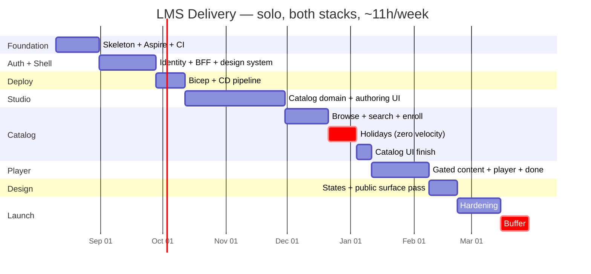

# 08 — Delivery Plan

> Solo build, **both API and frontend**. 1-week sprints, ~11h/week (evenings + one weekend morning).
> Tracked in **GitHub Projects**. Scope is defined by [`00 §3`](00-overview.md#3-requirements-mvf); build order follows [`07`](07-roadmap.md).
> **Start:** Monday 10 Aug 2026 · **MVP feature-complete:** 7 Feb 2027 · **Launch-ready:** 14 Mar 2027
>
> *Revision 3 — added the UI/UX design track (§1.2). M1–M4 unchanged; M5 moves out two weeks.*

---

## 1. Scope: this plan covers the whole product

Every card is tagged `api`, `web`, `infra`, or `both`. The split across the full 145 points:

| Area | Points | Share | What it is |
|---|---:|---:|---|
| **api** | 66 | 46% | Six Modules, ~44 endpoints, EF Core model, migrations, auth, events, outbox |
| **web** | 59 | 41% | Design system, BFF session layer, catalog, Studio authoring UI, player, completion |
| **infra** | 15 | 10% | Aspire AppHost, Bicep, Dockerfiles, CI/CD, observability, backups |
| **both** | 5 | 3% | Completion page, account-lifecycle pages — endpoint and screen in one card |

Sprints deliberately **mix both stacks** rather than doing "all backend, then all frontend": an endpoint with no screen exercising it is an endpoint you have not really tested.

### 1.1 Frontend work, by phase

| Phase | Web cards | Pts |
|---|---|---:|
| Foundation | TanStack Start scaffold, `AddViteApp` wiring | 2 |
| Auth & Shell | **Design system + app shell**, BFF session layer, route guards, login/register, YouTube spike | 12 |
| Studio | Wireframes, course list, settings form, curriculum tree + reorder, lesson editor | 13 |
| Catalog | Wireframes, browse page (SSR + search), course detail, My Learning | 9 |
| Player | Player shell, reading view, YouTube player + heartbeats | 10 |
| Design & Hardening | **States pass, public surface design pass**, Playwright, CSP | 13 |
| **Total** | | **59** |

---

## 1.2 UI/UX: how design happens when there is no designer

**Your question: do we just make a simple design to finish the sprint?**
Yes for Studio. No for the public pages. And there is a discipline that makes "simple first" a stage rather than a debt you never repay.

### Three surfaces, three standards

| Surface | Standard | Why |
|---|---|---|
| **Studio** (authoring) | shadcn defaults. Plain, dense, functional. **Never gets a polish pass.** | It is behind a login, used by curated engineers, and it is a tool. Clear beats pretty. Spending design time here is spending it in the one place nobody evaluates you on. |
| **Player** (learning) | Layout right the first time; decoration never. | Students live here for hours. Sidebar / content / progress structure is *usability*, not polish — and it is expensive to restructure later. Settle it in wireframes, then build plain. |
| **Public** (landing, catalog, course detail, completion) | A deliberate design pass before launch. | This is the entire first impression. For a product that sells on perceived quality — the dometrain comparison in the brief — **design here is a feature, not polish.** A great course behind an amateurish catalog page does not get enrolled in. |

### Five rules that make "build simple first" safe

1. **Do not design components. Choose a system.** shadcn/ui + Tailwind *is* the design decision, made once in `W-1`. You never design a button, a dialog, or a form field. Radix underneath also gives you keyboard navigation and ARIA for free — accessibility you would otherwise retrofit painfully.

2. **Pick tokens once, in Sprint 6.** One accent colour, a type scale, a spacing scale, one border radius, and **both light and dark themes as CSS variables**. Your audience is engineers; dark mode is table stakes. It is nearly free if tokens exist from day one and genuinely miserable to retrofit if they do not.

3. **Do design layouts — cheaply, on paper.** Thirty minutes per screen group in Excalidraw or a notebook, *before* writing components. A layout mistake costs minutes on paper and hours in JSX. That is `W-2` and `W-3`, one point each, scheduled immediately before the UI phase they serve — late enough that you know what data exists, early enough to matter.

4. **Steal layout patterns openly.** Screenshot dometrain, Frontend Masters, Egghead, Pluralsight. Note *how* they structure a course card, a curriculum sidebar, a lesson page, a pricing table. Studying structure is research; copying visual identity is not. They solved the same problems with a design team you do not have.

5. **States are design.** Loading skeletons, empty states ("no courses yet" — with a call to action), error boundaries, the 403 not-enrolled screen, toasts on save. This is the single largest gap between "it works" and "it feels finished", and it is *always* what gets skipped under sprint pressure. It gets its own card (`W-4`) precisely so it cannot be.

### Why the polish is scheduled, not intended

"We will make it nice later" fails for a predictable reason: later never gets a sprint, because there is always another feature. The only fix is putting design on the board with dates:

| Card | What | Sprint | Pts |
|---|---|---|---:|
| `W-1` | Design system + app shell: tokens, light/dark, layout, nav, markdown renderer | 6 | 3 |
| `W-2` | Wireframe pass — Studio screens (low-fi, throwaway) | 14 | 1 |
| `W-3` | Wireframe pass — public catalog + player screens | 19 | 1 |
| `W-4` | States pass: skeletons, empty states, error boundaries, toasts, 403 screen | 27 | 3 |
| `W-5` | Public surface design pass: landing, catalog, course detail, completion | 28 | 5 |

**Cost: 10 points ≈ 2 sprints**, and all of it lands *after* M4. So M1–M4 do not move at all; launch-ready shifts from 28 Feb to **14 Mar**.

If you would rather hold February: pull descope lever #1 (drag-and-drop → up/down buttons, 3 pts) and #7 (attachments, 5 pts) from §8. That pays for the design work out of Studio scope. Given you have no fixed deadline, I would take the two weeks instead — attachments are more useful to a student than a slightly nicer reorder control.

---

## 2. How Agile works when you are the whole team

Most of Scrum exists to coordinate people. You have no one to coordinate with, so running it by the book means performing ceremonies for an audience of one. Keep the parts that create feedback and pressure; drop the parts that only transmit information.

| Keep | Why |
|---|---|
| **Fixed 1-week timebox** | The only thing forcing you to finish rather than polish. A slip costs one week, not a month. |
| **One sprint goal, in a sentence** | If you cannot state it in a sentence, the sprint is a to-do list, not a goal. |
| **WIP limit of 1** | The dominant solo failure mode is four half-finished branches. One card in progress. Always. |
| **Definition of Done** | You are your own reviewer. Written criteria are what stop "done" from meaning "it ran once." |
| **Weekly review (30 min)** | Sunday. What shipped, what did not, why. Five bullets in a file. |
| **Measured velocity** | Points completed per sprint. After three sprints you know your real number and re-plan against it. |

| Drop | Why |
|---|---|
| Daily standup | You already know what you did yesterday. |
| Planning poker | Estimating alone is just estimating. |
| Retrospective as a meeting | Folded into the weekly review. |
| Burndown charts | The board shows it. Do not build reporting for yourself. |
| Story-point negotiation | Nobody to negotiate with. |

**The one thing solo builds lose that teams have: a demo to someone else.** Without it, "done" quietly degrades. At each milestone, show it to an actual human — a friend, a Discord channel, a screen recording you post somewhere. The prospect of someone watching is what keeps the last 10% honest.

### 2.1 Weekly rhythm

| When | Hours | Use |
|---|---|---|
| Mon–Thu evenings | 1.5–2h each (6–8h) | Build. One card at a time. |
| Saturday morning | 3–4h | The hardest card of the week — the one needing an uninterrupted block. |
| Sunday, 20 min | — | Review the sprint, move cards, set next week's goal. |
| Friday + Sunday daytime | 0 | **Protected.** A pace you cannot hold for seven months is not a plan. |

Total: **~11h/week**. The plan assumes **5 points/week**, where 1 point ≈ 2 hours of focused work. The gap between 11 raw hours and 10 productive ones is context-switching, and it is real.

### 2.2 Revision history

**Revision 2 — frontend audit.** Two genuine gaps in the first draft: no card existed for the app shell (Tailwind/shadcn setup, layout, nav, markdown rendering were implicitly folded into the scaffold card), and two Studio UI cards were underestimated — a two-level drag-reorder tree and a dual-mode lesson editor are 5 points each, not 3. Net +11 points. The YouTube spike the risk register recommended also got a real slot (`SP-1`, Sprint 7).

**Revision 3 — design track.** Added `W-2`–`W-5` (§1.2): wireframe passes before each UI phase, a states pass, and a public-surface design pass. Net +10 points, all after M4. Deferred `C-8` (popular sort) out of the M3 sprint to keep it at 5 points.

This is what the "re-baseline" mechanism in §2.3 is for — it happened at review time rather than at Sprint 3.

### 2.3 Estimation basis and the honesty caveat

**1 point ≈ 2 focused hours.** Total scope: **145 points ≈ 29 working sprints**.

Two things are built into the calendar rather than hoped away:

- **Sprints 20 and 21 (21 Dec – 3 Jan) are planned at zero velocity.** Holidays. Any work done then is pull-forward, not catch-up.
- **Sprints 32–33 are buffer.** Unallocated. They exist because seven-month solo estimates slip, and a plan with no slack converts every surprise into a missed date.

**Treat Sprints 1–3 as velocity calibration.** The 5 pts/week figure is a hypothesis, not a measurement. After Sprint 3, divide points completed by 3 and re-baseline every date below against your actual number. If it comes out at 3.5, launch moves to June — and knowing that in September is worth far more than defending a date set in August.

---

## 3. Timeline



### 3.1 Milestones

| # | Milestone | Sprint | Date | You can demonstrate |
|---|---|---|---|---|
| **M1** | Hello, deployed | 9 | **11 Oct 2026** | Register and log in on a real Azure URL, on a styled page. |
| **M2** | An instructor can publish | 16 | **29 Nov 2026** | Author a full course with video + reading lessons and publish it. |
| **M3** | A student can find and enroll | 22 | **10 Jan 2027** | Browse signed out, watch a preview, register, enroll, see it in My Learning. |
| **M4** | **MVP feature-complete** | 26 | **7 Feb 2027** | The whole loop, R1–R8. Functional, not yet pretty. |
| **M5** | **Launch-ready** | 31 | **14 Mar 2027** | Designed, hardened, tested end-to-end, monitored, backups rehearsed. |
| — | Buffer exhausted | 33 | 28 Mar 2027 | If you are past here, re-baseline rather than push. |

> **M4 is deliberately "works but plain."** That is the point of the design track — you get a functioning product first, then make the public surface good, rather than polishing screens whose data model is still moving.

---

## 4. Sprint plan

Every sprint has **one goal** and a demoable outcome. If a sprint's demo does not work, the sprint did not finish — carry the card, do not declare it done.

Area tags: `api` · `web` · `infra`

### Phase 1 — Foundation · Sprints 1–3 · 15 pts

| Sprint | Dates | Goal | Cards | Pts |
|---|---|---|---|---|
| **1** | Aug 10–16 | *The stack starts with one command.* | `F-1` Solution, 6 Module projects, SharedKernel (Result, Error, PagedResult, IClock, AuthPolicies, IEventBus) — 3 `api`<br>`F-2` Aspire AppHost: Postgres + Azurite, persistent volumes, dashboard — 2 `infra` | 5 |
| **2** | Aug 17–23 | *A real database, behind a real health check.* | `F-3` ServiceDefaults, `/health/*`, OpenAPI, ProblemDetails middleware — 3 `api`<br>`F-4` MigrationService + first migration; UUIDv7 + `xmin` conventions — 2 `api` | 5 |
| **3** | Aug 24–30 | *Guardrails up, frontend talking to the API.* | `F-5` NetArchTest boundary rules — 2 `api`<br>`F-6` GitHub Actions: build + test + arch test — 1 `infra`<br>`F-7` TanStack Start scaffold, `AddViteApp`, server fn hitting `/health` — 2 `web` | 5 |

**Demo (Sprint 3):** `dotnet run` on the AppHost → dashboard green, web page renders data fetched from the API through a server function, CI passes on a PR.

> **Re-baseline here.** Actual points ÷ 3 = your velocity. Adjust everything below.

### Phase 2 — Auth & Design System · Sprints 4–7 · 20 pts

The riskiest part of the build, deliberately scheduled early. If the BFF pattern is going to fight you, find out in September, not February.

| Sprint | Dates | Goal | Cards | Pts |
|---|---|---|---|---|
| **4** | Aug 31–Sep 6 | *Users exist and can get a token.* | `A-1` Identity Module: AppUser, roles, EF stores, register/login — 3 `api`<br>`A-2` JWT bearer validation + three policies — 2 `api` | 5 |
| **5** | Sep 7–13 | *The browser holds a session, never a token.* | `A-3` BFF: encrypted `__Host-session` cookie, login/logout server fns, transparent refresh — 4 `web` ⚠️<br>`A-4` `GET /api/me` — 1 `api` | 5 |
| **6** | Sep 14–20 | *Every future screen inherits a look.* | `W-1` **Design system + app shell**: Tailwind tokens (colour, type scale, spacing, radius), light **and** dark via CSS variables, shadcn install, layout + nav, markdown renderer with sanitization — 3 `web`<br>`A-6` Admin grant-instructor, seeded admin, InstructorProfile — 2 `api` | 5 |
| **7** | Sep 21–27 | *Roles gate the UI and the API.* | `A-5` `_authed` / `_instructor` route guards, login + register pages — 3 `web`<br>`SP-1` **Spike:** YouTube IFrame API — play, `getCurrentTime()`, `sendBeacon` on unload. Timeboxed, throwaway — 2 `web` | 5 |

**Demo (Sprint 7):** Register → log in on a styled page → DevTools shows the session cookie is `HttpOnly` and **no token is reachable from JS**. Admin grants Instructor; the Studio link appears.

> `W-1` is the highest-leverage card in the plan. Every screen from Sprint 14 onward inherits it, and if the tokens are not set here, "make it consistent later" becomes a rewrite. `SP-1` retires risk **R2** four months before you need the real thing — throw the code away, keep the notes.

### Phase 3 — Deploy · Sprints 8–9 · 9 pts

| Sprint | Dates | Goal | Cards | Pts |
|---|---|---|---|---|
| **8** | Sep 28–Oct 4 | *Infrastructure exists.* | `D-1` Bicep: RG, Postgres Flexible Server, Storage, Key Vault, Container Apps env + 2 apps — 5 `infra` | 5 |
| **9** | Oct 5–11 | *A push to main goes live.* | `D-2` Dockerfiles for api + web — 2 `infra`<br>`D-3` CD: build/push, migration job, deploy revision — 2 `infra` | 4 |

**🏁 M1 — Demo:** Log in at a real `*.azurecontainerapps.io` URL.

> Deploying before the features exist is deliberate. The alternative is discovering managed-identity, connection-string, and CORS problems in February while also debugging the player.

### Phase 4 — Instructor Studio · Sprints 10–16 · 35 pts

The largest phase. Four sprints of API, then three of UI on top of it.

| Sprint | Dates | Goal | Cards | Pts |
|---|---|---|---|---|
| **10** | Oct 12–18 | *Courses exist.* | `S-1` Catalog domain: Course/Chapter/Lesson + invariants + migration — 3 `api`<br>`S-2` Course CRUD endpoints — 2 `api` | 5 |
| **11** | Oct 19–25 | *A course has structure.* | `S-3` Chapter CRUD + reorder — 2 `api`<br>`S-4` Lesson CRUD + move — 3 `api` | 5 |
| **12** | Oct 26–Nov 1 | *A lesson has content, and publish has teeth.* | `S-5` Video (YouTube URL parse/validate) + Reading, content invariant — 3 `api`<br>`S-6` Publish/unpublish/archive + full 422 invariant report — 2 `api` | 5 |
| **13** | Nov 2–8 | *Files upload without touching the API.* | `S-7` Media Module: user-delegation SAS + thumbnail flow — 3 `api`<br>`S-8` Attachments: upload-url, confirm, delete — 2 `api` | 5 |
| **14** | Nov 9–15 | *Studio exists, and it is safe.* | `W-2` **Wireframe pass — Studio screens** (low-fi, 30 min each, throwaway) — 1 `web`<br>`S-9` Course list + settings form — 2 `web`<br>`S-12` Ownership checks + two-instructor test + stats — 2 `api` | 5 |
| **15** | Nov 16–22 | *The curriculum is editable.* | `S-10` Curriculum tree + drag reorder (dnd-kit, two levels) — 5 `web` | 5 |
| **16** | Nov 23–29 | *Authoring is complete.* | `S-11` Lesson editor: video/reading toggle, markdown preview, thumbnail + attachment widgets — 5 `web` | 5 |

**🏁 M2 — Demo:** Create a course, two chapters, four lessons (2 YouTube + 2 markdown), upload a thumbnail and a PDF, fail publish on an empty chapter, fix it, publish.

> Studio is built to shadcn defaults and **never revisited**. Resist the urge — nobody outside your instructor list will ever see it.

### Phase 5 — Catalog & Enrollment · Sprints 17–19, 22 · 20 pts

| Sprint | Dates | Goal | Cards | Pts |
|---|---|---|---|---|
| **17** | Nov 30–Dec 6 | *Published courses are discoverable.* | `C-1` Public browse/detail/instructor endpoints + output caching — 3 `api`<br>`C-2` `tsvector` search column + GIN index — 2 `api` | 5 |
| **18** | Dec 7–13 | *Students can enroll.* | `C-3` Enrollment Module, idempotent enroll, `IEntitlementService` seam — 3 `api`<br>`C-4` `GET /api/me/enrollments` — 2 `api` | 5 |
| **19** | Dec 14–20 | *The catalog is browsable.* | `W-3` **Wireframe pass — public + player screens** — 1 `web`<br>`C-5` Browse page: search, filters, SSR, pagination — 4 `web` | 5 |
| **20** | Dec 21–27 | 🎄 **Holiday — planned zero.** | — | 0 |
| **21** | Dec 28–Jan 3 | 🎄 **Holiday — planned zero.** | — | 0 |
| **22** | Jan 4–10 | *The student's own view.* | `C-6` Course detail page + preview player + enroll CTA — 2 `web`<br>`C-7` My Learning page — 2 `web`<br>`C-9` `viewer` block via `IEnrollmentLookup` — 1 `api` | 5 |

**🏁 M3 — Demo:** Browse signed out, watch a preview, register, enroll, land on My Learning at 0%.

**Verify explicitly:** the course-detail payload contains **no** `externalVideoId` for non-preview lessons. Check the network tab, not the UI.

> `W-3` covers the player layout too, not just the catalog — settling the sidebar/content/progress structure *before* Sprint 24 is what stops you rebuilding it in February.

### Phase 6 — Player & Completion · Sprints 23–26 · 21 pts

| Sprint | Dates | Goal | Cards | Pts |
|---|---|---|---|---|
| **23** | Jan 11–17 | *Content is gated at the API.* | `P-1` `GET /api/learn/{slug}` + gated lesson endpoint (403 logic) — 3 `api`<br>`P-2` LessonProgress + monotonic progress upsert — 2 `api` | 5 |
| **24** | Jan 18–24 | *A student can navigate a course.* | `P-3` Player shell: curriculum sidebar, routing, prev/next, resume — 4 `web`<br>`P-6` Attachment download SAS — 1 `api` | 5 |
| **25** | Jan 25–31 | *Both lesson types work, video reports progress.* | `P-4` Reading lesson view + mark complete — 2 `web`<br>`P-5` YouTube IFrame player + heartbeats + `sendBeacon` — 4 `web` (de-risked by `SP-1`) | 6 |
| **26** | Feb 1–7 | *The loop closes.* | `P-7` Completion calc + `CourseCompleted` + outbox **sender** + email — 3 `api` *(the outbox table itself shipped in `F-4`)*<br>`P-8` Completion page + suggestions — 2 `both` | 5 |

**🏁 M4 — Demo:** Enroll, watch a video to 90% and see it auto-tick, mark a reading complete, close the tab mid-lesson and resume at the right second, finish the last lesson, get the congratulations screen with three suggestions and an email.

**Verify explicitly:** `GET /api/learn/lessons/{id}` for a non-preview lesson, from a raw HTTP client, with no enrollment → **403**. If it returns content, R8 is not implemented.

### Phase 7 — Design Pass · Sprints 27–28 · 10 pts

Everything works. Now make the parts strangers see look like a product.

| Sprint | Dates | Goal | Cards | Pts |
|---|---|---|---|---|
| **27** | Feb 8–14 | *It stops feeling like a prototype.* | `W-4` **States pass**: loading skeletons, empty states with CTAs, error boundaries, 403 not-enrolled screen, save toasts — across every screen — 3 `web`<br>`C-8` `EnrollmentCount` via events + popular sort — 2 `api` | 5 |
| **28** | Feb 15–21 | *The first impression is good.* | `W-5` **Public surface design pass**: landing page, catalog grid, course detail, completion page. Real spacing, hierarchy, imagery, responsive down to 375px, dark mode verified — 5 `web` | 5 |

**Demo:** Open the landing page on a phone, in dark mode, signed out. Would you enter your email address on it?

> Studio and the player are explicitly **not** in this pass. Only the surfaces a prospective student sees before they trust you.

### Phase 8 — Hardening & Launch · Sprints 29–31 · 15 pts

| Sprint | Dates | Goal | Cards | Pts |
|---|---|---|---|---|
| **29** | Feb 22–28 | *Account lifecycle is real.* | `H-1` Email confirmation + password reset (endpoints + pages) — 3 `both`<br>`H-2` Refresh-token revocation + 2FA for Admin — 2 `api` | 5 |
| **30** | Mar 1–7 | *The critical paths are tested and locked down.* | `H-3` Playwright: author→publish, enroll→complete — 3 `web`<br>`H-4` CSP, security headers, dependency scan — 2 `web` | 5 |
| **31** | Mar 8–14 | *You will know when it breaks.* | `H-5` App Insights dashboard + 5xx/outbox alerts — 2 `infra`<br>`H-6` Orphan-blob cleanup + role-grant audit log — 2 `api`<br>`H-7` Backup **restore** rehearsal — 1 `infra` | 5 |

**🏁 M5 — Launch-ready.**

| **32–33** | Mar 15–28 | **Buffer.** Unallocated by design. | | 0 |

---

## 5. GitHub Projects setup

One project board, `LMS Delivery`, table + board views.

**Custom fields**

| Field | Type | Values |
|---|---|---|
| `Sprint` | Iteration | 1 week, starting 2026-08-10 |
| `Points` | Number | 1, 2, 3, 4, 5 |
| `Epic` | Single select | Foundation · Auth · Deploy · Studio · Catalog · Player · Design · Hardening |
| `Area` | Single select | api · web · infra · both |
| `Risk` | Single select | normal · high |

**Board columns:** `Backlog` → `Ready` → `In Progress` *(WIP limit 1)* → `Blocked` → `Done`

**Milestones:** M1–M5 from §3.1, so the milestone progress bar tracks the real schedule.

Group the board by `Area` occasionally. If `web` has been empty for four sprints, you are building an API with no way to see it — that is the failure mode this plan is arranged to prevent.

**Issue template** — every card carries its acceptance criteria, because you are also the reviewer:

```markdown
## Goal
<one sentence>

## Acceptance criteria
- [ ] <observable behaviour, not implementation>
- [ ] <the failure case, explicitly>

## Done checklist
- [ ] Tests pass locally and in CI
- [ ] Arch test green
- [ ] Design docs updated if the contract changed
```

**Seeding the board** — the pattern, using the `gh` CLI:

```bash
gh issue create --title "F-1 Solution skeleton + SharedKernel" --label "epic:foundation,area:api" --milestone "M1 Hello, deployed" --body-file .github/ISSUE_TEMPLATE/card.md
```

Ask me to generate the full script for all 58 cards and I will write it out.

---

## 6. Definition of Ready / Done

A card is **Ready** when: the goal is one sentence; acceptance criteria are written and observable; it is ≤5 points (bigger → split); and it has no unresolved dependency on an unstarted card.

A card is **Done** when:

- [ ] Acceptance criteria all demonstrably met — you ran it, you did not reason about it
- [ ] Unit tests for domain invariants; integration test for any new endpoint
- [ ] `Lms.ArchitectureTests` green
- [ ] No new compiler or lint warnings
- [ ] **UI cards:** works at 375px wide, and in both light and dark themes
- [ ] Deployed to Azure and working there (from M1 onward — **not** "works locally")
- [ ] Design docs updated if the API contract or model changed
- [ ] Merged to `main`, branch deleted

The responsive/dark-mode line is what stops the design pass in Sprint 28 turning into a rewrite. Checking it per card costs a minute; discovering it across thirty screens costs a sprint.

---

## 7. Risk register

| # | Risk | Impact | Mitigation |
|---|---|---|---|
| **R1** | **BFF session/refresh pattern fights you.** TanStack Start's server-function + cookie story is the least-travelled path in the stack. | 1–2 sprints | Scheduled at Sprint 5, early on purpose. **Timebox to 6 hours**; if it is not working, fall back to a same-site cookie issued by the API directly and revisit later. |
| **R2** | **YouTube IFrame progress tracking is flakier than expected** — `sendBeacon` on unload, autoplay policies, mobile Safari. | 1 sprint | **Retired early by `SP-1` (Sprint 7)**, four months before the real card. Fallback: manual "Mark complete" only for video. |
| **R3** | **Velocity is lower than 5 pts/week.** The most likely risk on this list. | Weeks–months | Re-baseline after Sprint 3 and again after Sprint 9. Pull the descope levers in §8 rather than extending evenings. |
| **R4** | **Life happens** — illness, work crunch, family. | 1–3 sprints | Two holiday sprints and two buffer sprints already absorb ~4 weeks. **Protocol: skip the sprint entirely, do not half-run it.** |
| **R5** | **Scope creep from your own good ideas.** | Unbounded | Everything not in [`00 §3`](00-overview.md#3-requirements-mvf) goes to a `Post-MVP` column. The non-goals list in [`00 §4`](00-overview.md#4-non-goals-for-mvp) is the contract with yourself. |
| **R6** | **Aspire / TanStack Start version churn** mid-build. | Days | Pin versions at Sprint 1 ([`06 §6`](06-tech-stack.md#6-version-notes)). Upgrade only between phases, never mid-sprint. |
| **R7** | **Context-switching cost between two stacks.** | Ongoing drag | Sprints group by stack where possible (Studio: 4 API sprints, then 3 UI). Within a sprint, finish the API card before starting the web card — do not alternate daily. |
| **R8** | **Design rabbit-hole.** The most seductive risk: fiddling with spacing is pleasant, and it feels like progress. | Unbounded | Design is confined to `W-1`–`W-5` with point budgets. **Studio is explicitly excluded from polish, forever.** If you catch yourself adjusting Studio CSS, stop — that is procrastination wearing a productive hat. |
| **R9** | **Studio is 7 sprints with student-facing progress invisible until M3.** Motivation risk. | Morale | M2's demo is the antidote. If it drags, pull `C-1`/`C-5` forward to see your own course in a catalog sooner. |

---

## 8. Descope levers

Pull in this order when behind. Roughly **16 points ≈ 3 sprints** of slack, without touching R1–R8.

| Order | Cut | Saves | Area | Cost |
|---|---|---:|---|---|
| 1 | Drag-and-drop reorder → up/down arrow buttons | 3 | `web` | Slightly clunkier Studio. Genuinely fine, and the largest cheap win. |
| 2 | Lesson `move` between chapters | 1 | `api` | Delete and recreate. Rare operation. |
| 3 | Studio stats page | 1 | `both` | No analytics at launch. |
| 4 | Instructor profile pages | 2 | `both` | Instructor name only, no bio page. |
| 5 | `Archived` course status | 1 | `api` | Draft/Published only. |
| 6 | Congratulations **email** — keep the on-screen page | 3 | `api` | Drops the whole Notifications outbox. R5 still met. |
| 7 | Lesson attachments (upload + download) | 5 | `both` | Big saving. Video + notes still work. Cut this before cutting anything in R1–R8. |

**Never cut:** the enrollment gate (`P-1`), ownership checks (`S-12`), the publish invariants (`S-6`), the arch tests, or **`W-1`**. The design system is the one design card that is cheaper to do than to skip — everything after it depends on the tokens existing.

`W-4` (states) and `W-5` (public surface) *are* cuttable if you must ship in February, but understand the trade: you would be launching a product whose first impression is unfinished, to an audience that judges engineering products on exactly that.

---

## 9. First week

Do not start with the domain model. Start by making the loop turn.

1. **Mon:** `dotnet new sln`, six Module projects, `Lms.SharedKernel` with `Result` and `Error`.
2. **Tue:** `Lms.AppHost` — Postgres with `WithDataVolume()` + `ContainerLifetime.Persistent`. Get the dashboard up.
3. **Wed:** Azurite on the same terms. Confirm data survives a full restart — that is `F-2`'s real acceptance criterion.
4. **Thu:** Wire `AddXModule`/`MapXEndpoints` stubs into `Program.cs`. One `/health/live` returning 200.
5. **Sat:** Set up the GitHub Project, seed Sprints 1–4 from §4, write the issue template.
6. **Sun (20 min):** First review. Record actual hours worked — that number, not this document, is your real velocity.

> Not in week 1: colours, fonts, or logos. That is Sprint 6, and doing it now is the R8 rabbit hole before you have written a line of domain code.
